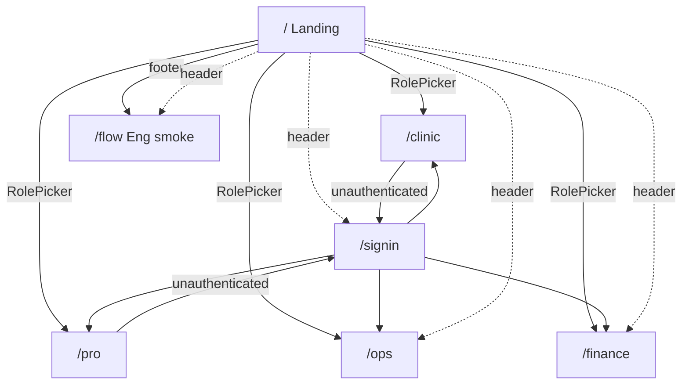
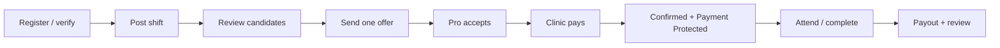

# ProBooking — Information Architecture

**Audience:** Product, design, eng  
**Purpose:** Map every product surface, navigation path, role, and end-to-end flow  
**Sources:** PRD v1.5 §3–§6, web App Router, NestJS marketplace/auth APIs, BDD areas 01–20, worker jobs  
**Stage reflected:** Phase 0 — Concierge Validation (current UI + API + background jobs)

Companion docs:

| Doc | Owns |
|---|---|
| [`PRD_v1.5.md`](PRD_v1.5.md) | Product behavior (source of truth) |
| [`architecture.md`](architecture.md) | System shape and vertical slice |
| [`investor-demo-capabilities.md`](investor-demo-capabilities.md) | Hands-on demo checklist |
| [`ops-tools.md`](ops-tools.md) | Internal Ops/Finance tools note |
| [`../features/README.md`](../features/README.md) | Executable acceptance catalog |

---

## 1. Product frame

ProBooking is a two-sided marketplace for **temporary clinic shifts** in Thailand.

> **Verified. Available. Bookable. Payment Protected.**

| Side | Job to be done |
|---|---|
| **Clinic** | Find, invite, offer, pay, and complete a temporary professional shift |
| **Professional** | Find verified work, accept clear terms, attend, and get paid |
| **Operations** | Verify parties, resolve holds/cases, keep the marketplace trustworthy |
| **Finance** | Reconcile money, run dual-control refunds, export truth |
| **System (worker)** | Time-driven completion, expiry, reminders, review publish |

A normal booking is self-service. Humans handle verification and exceptions behind the scenes (PRD §1.2).

---

## 2. Site map (web surfaces)

Routes live under `apps/web/src/app/`. GitHub Pages may prefix `/probooking` (`NEXT_PUBLIC_BASE_PATH`).

```
/
├── /                    Landing — brand, role picker, how-it-works
├── /signin              Demo sign-in / role switch / reset demo
├── /clinic              Clinic owner workspace
├── /pro                 Professional workspace
├── /ops                 Operations console
├── /finance             Finance reconciliation & refunds
└── /flow                Eng smoke harness (full vertical slice)
```

### 2.1 Surface inventory

| Route | Audience | Entry | In-page sections |
|---|---|---|---|
| `/` | Everyone | Direct / brand | Hero → Role picker → How it works → Footer (link to `/flow`) |
| `/signin` | Demo users | Header “Sign in” | Role picker + reset demo |
| `/clinic` | Clinic owner | Role picker | Post shift → My shifts (candidates / offer / confirm) → Bookings (complete / cancel) |
| `/pro` | Professional | Role picker | Offers → Open shifts (apply) → My jobs (arrive / complete / review) |
| `/ops` | Operations | Role picker or header | Metrics → Pending verification → Open cases → Active bookings (hold / suspend) |
| `/finance` | Finance | Role picker or header | Summary → Reconciliation → Propose/approve refunds → CSV export |
| `/flow` | Eng / e2e | Footer or header | Automated register→…→review harness |

There is **no nested route tree** and **no sidebar app shell**. Deep work happens as sections on role pages. Global chrome is `AppHeader` (Home · Ops · Finance · Flow · Sign in) plus theme toggle; `/clinic` and `/pro` are reached only via the role picker.

### 2.2 Navigation model



---

## 3. Actors, authority, and entry

### 3.1 Roles (PRD §3)

| Role | Primary surface | Binding / money authority |
|---|---|---|
| `clinic_owner` | `/clinic` | Post, offer, pay, cancel, confirm completion |
| `clinic_staff` | *(API only today)* | Draft / search / shortlist / message — no money |
| `professional` | `/pro` | Profile, availability, apply, accept, complete, review |
| `operations` | `/ops` | Verify, cases, holds, suspensions |
| `finance` | `/finance` | Payout/refund/reconcile; dual-control on high-value |
| `administrator` | API / staff phones | Access, high-risk, config, exceptional approval |
| `worker` | Background jobs | Auto-accept, flag inactive — no human UI |

### 3.2 Auth states

1. **Anonymous** — `/`, `/signin`, `/flow`
2. **Party session** — clinic or professional JWT (OTP) → `/clinic` or `/pro`
3. **Staff session** — ops/finance/admin via `STAFF_PHONES` → `/ops` or `/finance`
4. **Unverified party** — may register/browse; cannot post or transact until Ops verifies

**Auth mechanism:** Thai mobile OTP (`POST /auth/otp/request`, `/verify`). Token proves phone possession; **authority is derived from the identity graph** (membership / professional profile / staff phones), never from a role claimed in the request body. Browser session: `sessionStorage` key `probook.session`.

Demo accounts (`lib/demo-accounts.ts`) map one-click to each surface; `/signin` can reset seeded data (`POST /demo/reset`).

---

## 4. Domain objects (content model)

Owned records are the source of truth; customer labels are **derived**; holds and cases are **overlays** (PRD §6.2).

```
Identity
  User ──┬── Membership ── ClinicWorkspace (branch, verification)
         └── ProfessionalProfile ── Credential, InsuranceEvidence,
                                    PayoutAccount, Availability

Marketplace
  Shift ── Application | Invitation | Offer (≤1 active/shift) ── Booking (≤1/shift)

Booking overlays
  Message, AttendanceEvent, Review, heldAt (credential hold)

Ops
  SupportCase, RiskIncident, AuditRecord, ApprovalRequest

Finance (append-only)
  PaymentOrder → FinancialAllocation → FinancialEvent
  (Collection | Refund | Payout | Reversal | Adjustment | ProviderCost)

Notifications
  Notification (email/SMS send audit)
```

### 4.1 Primary state machines

| Object | States (abbrev.) |
|---|---|
| Shift | Draft → Published → Paused / Closed / Cancelled / Archived |
| Application | Submitted → Shortlisted → OfferSent → Booked \| Declined / Withdrawn / NotSelected / Expired |
| Invitation | Sent → Viewed → Interested \| Declined / Withdrawn / Expired |
| Offer | PendingResponse → AwaitingPayment → Converted \| Declined / Withdrawn / Expired / PaymentFailed |
| Booking | Confirmed → InProgress → AwaitingCompletion → ServiceCompleted \| Cancelled / Archived |
| PaymentOrder | Created → Pending → PaymentProtected \| Failed / Expired / Refunding / Refunded / Exception |
| Payout | NotEligible → Processing → Paid \| Failed / Held / Reversed |
| Verification | Draft → Submitted → UnderReview → NeedsInformation → Verified \| Rejected / Suspended / Expired / Closed |
| Case | Open → AwaitingUser / UnderReview → Resolved \| Reopened |

Money unit: **satang** (integer). Default clinic fee: **12%** (`SERVICE_FEE_BPS=1200`).

---

## 5. Flow catalog

Flows are grouped by journey. Each lists **entry**, **steps**, **primary APIs**, and **UI coverage** (`UI` = interactive page, `API` = endpoint exists, `Worker` = background, `Gap` = PRD/BDD without dedicated party UI).

---

### Flow A — Orientation & access

| ID | Flow | Entry | Steps | Coverage |
|---|---|---|---|---|
| A1 | Land & understand product | `/` | Brand → promise → role picker → how-it-works | UI |
| A2 | Demo sign-in / role switch | `/` or `/signin` | Pick account → OTP → land on role route | UI |
| A3 | Reset demo dataset | `/signin` | Confirm → `POST /demo/reset` → clear session | UI |
| A4 | Logout / session revoke | Any signed-in surface | `POST /auth/logout`; admin may revoke/suspend | API (+ partial UI) |
| A5 | Staff OTP gate | `/ops`, `/finance` | Wrong role → 403 → signed out | UI |

---

### Flow B — Clinic happy path (staff a shift)

**PRD §4.1.** Primary UI: `/clinic` (plus role switch to `/pro` for the other side).



| ID | Step | Actor | API | UI |
|---|---|---|---|---|
| B1 | Register clinic | Clinic | `POST /clinics` | Gap on `/clinic` (seeded / `/flow`) |
| B1b | Ops verifies clinic | Ops | `POST /ops/clinics/:id/verify` | `/ops` |
| B2 | Post open shift (± urgent) | Clinic owner | `POST /shifts` | `/clinic` |
| B3a | List my shifts | Clinic | `GET /clinics/:id/shifts` | `/clinic` |
| B3b | View candidates | Clinic | `GET /shifts/:id/candidates` | `/clinic` |
| B3c | Review applications | Clinic | via candidates / apply path | Partial |
| B3d | Invite professional | Clinic | `POST /shifts/:id/invite` | Gap (API + BDD) |
| B4 | Send **one** binding offer | Clinic owner | `POST /shifts/:id/offer` | `/clinic` |
| B5 | Professional accepts (soft hold) | Pro | `POST /offers/:id/accept` | `/pro` |
| B6 | Confirm + pay (checkout split) | Clinic owner | `POST /offers/:id/confirm` | `/clinic` |
| B7 | Booking Confirmed / Payment Protected | System | confirm txn (BKG-02) | Status on both party UIs |
| B8a | Accept completion / release payout | Clinic | `POST /bookings/:id/accept-completion` | `/clinic` |
| B8b | Cancel booking | Clinic | `POST /bookings/:id/cancel` | `/clinic` |
| B9 | Leave review | Clinic | `POST /bookings/:id/reviews` | Via `/pro` / `/flow`; partial on clinic |

---

### Flow C — Professional happy path (find work & get paid)

**PRD §4.2.** Primary UI: `/pro`.

| ID | Step | Actor | API | UI |
|---|---|---|---|---|
| C1 | Register professional | Pro | `POST /professionals` | Gap (seeded / `/flow`) |
| C1b | Ops verifies pro (+ insurance) | Ops | `POST /ops/professionals/:id/verify`, `…/verify-insurance` | `/ops` |
| C2 | Set availability | Pro | `POST/GET /professionals/:id/availability` | Gap (API + BDD) |
| C3 | Browse open shifts | Pro | `GET /shifts` | `/pro` |
| C4a | Apply (non-binding) | Pro | `POST /shifts/:id/apply` | `/pro` |
| C4b | Respond to invitation | Pro | invitation states | Gap (API + BDD) |
| C5 | Accept / decline offer | Pro | `POST /offers/:id/accept` | `/pro` |
| C6 | See Payment Protected | Pro | offer/booking status | `/pro` |
| C7a | Mark arrived | Pro | `POST /bookings/:id/arrive` | `/pro` |
| C7b | Mark complete | Pro | `POST /bookings/:id/complete` | `/pro` |
| C8 | Track payout | Pro | booking / receipt | Partial |
| C9 | Leave review | Pro | `POST /bookings/:id/reviews` | `/pro` |
| C10 | View profile / rating | Anyone | `GET …/profile`, `…/rating` | `/flow` / API |

---

### Flow D — Confirmation, payment & conservation

| ID | Flow | Trigger | Behavior | Coverage |
|---|---|---|---|---|
| D1 | Soft hold on accept | Offer accept | Blocks overlapping accept (OFF-04) | API + BDD; UI via accept |
| D2 | Offer expiry | Timer / worker | Pending → Expired | Worker `expireOffers` |
| D3 | Atomic confirm | Clinic confirm | Eligibility + prefund + booking in one txn; unique `Booking.shiftId` | API |
| D4 | Checkout conservation | Confirm | Captured == compensation + fee + tax (PAY-07) | API + `/clinic` / `/flow` checkout |
| D5 | Late/duplicate provider callbacks | Payment port | Idempotent; no double collection | API + BDD area 06 |
| D6 | Receipt | After confirm/complete | `GET /bookings/:id/receipt` | API |
| D7 | Urgent priority | Shift flag | Badge / assisted outreach — **no fill guarantee** | UI post + BDD area 07 |

---

### Flow E — Completion, payout & auto-accept

| ID | Flow | Trigger | Behavior | Coverage |
|---|---|---|---|---|
| E1 | Pro submits completion | Pro complete | Booking → AwaitingCompletion; start 24h clock | `/pro` |
| E2 | Clinic accepts | Clinic | → ServiceCompleted + payout event | `/clinic` |
| E3 | Auto-accept after 24h | Worker | If still awaiting → accept-completion once | Worker `autoAccept` |
| E4 | Clinic inactive 48h | Worker | Opens Ops `completion_review` case | Worker `clinicReview` |
| E5 | Flag inactive | System/Ops | `POST /bookings/:id/flag-inactive` | API |
| E6 | Undisputed payout | Accept path | `Payout` FinancialEvent; status toward “within 1 business day” | API + Finance views |

---

### Flow F — Cancellation, no-show & support

**PRD §4.3 exception journey.**

| ID | Flow | Actor | API / behavior | Coverage |
|---|---|---|---|---|
| F1 | Cancel confirmed booking | Clinic (or rules-based) | `POST /bookings/:id/cancel` → refund/reconcile | `/clinic` |
| F2 | Open support case | Party / Ops | Cases list; state machine Open→…→Resolved | `/ops` (list); open-from-UI Gap |
| F3 | Ops reviews facts | Ops | `GET /ops/cases`, audit | `/ops` |
| F4 | Controlled money action | Finance / Admin | Refund propose/approve or payout hold | `/finance` |
| F5 | Visible outcome | System | Derived status + notifications | Partial |
| F6 | Immutable audit | System | `GET /ops/audit`; append-only DB | API (not wired in Ops UI) |

BDD: areas 10, 17.

---

### Flow G — Trust: verification, credentials, insurance

| ID | Flow | Actor | API | UI |
|---|---|---|---|---|
| G1 | Restricted browsing while unverified | System | AUTH-04 / VER gates | Enforced in API; UI mostly seeded verified |
| G2 | Verify clinic | Ops | `POST /ops/clinics/:id/verify` | `/ops` |
| G3 | Verify professional | Ops | `POST /ops/professionals/:id/verify` | `/ops` |
| G4 | Upload insurance evidence | Pro | `POST /professionals/:id/insurance` | Gap |
| G5 | Verify insurance | Ops | `POST /ops/professionals/:id/verify-insurance` | `/ops` |
| G6 | Suspend credential | Ops | `POST /ops/professionals/:id/suspend-credential` | `/ops` |
| G7 | Hold booking (overlay) | Ops | `POST /bookings/:id/hold-credential` | `/ops` |
| G8 | Resolve hold | Ops | `POST /bookings/:id/resolve-hold` | `/ops` |
| G9 | Hold blocks payout | System | accept-completion 400; worker skips held | API + worker |
| G10 | Block self / related-party booking | System | Domain policy | API + BDD |

BDD: areas 01, 13, 20.

---

### Flow H — Messaging & contact reveal

| ID | Flow | When | API | UI |
|---|---|---|---|---|
| H1 | Booking thread (plain text) | After confirmation | `POST/GET /bookings/:id/messages` | Gap |
| H2 | Contact reveal | After confirmation | `GET /bookings/:id/contact` | Gap |
| H3 | Patient-data rules | Always | MSG policies — no patient data in normal use | Domain + BDD area 08 |

---

### Flow I — Finance: reconcile, refund, export

| ID | Flow | Actor | API | UI |
|---|---|---|---|---|
| I1 | View reconciliation | Finance | `GET /finance/reconciliation` | `/finance` |
| I2 | Propose refund | Finance A | `POST /finance/refunds` | `/finance` |
| I3 | Approve refund (different person) | Finance B | `POST /finance/refunds/:id/approve` | `/finance` (switch demo account) |
| I4 | List pending refunds | Finance | `GET /finance/refunds` | `/finance` |
| I5 | CSV export | Finance | `GET /finance/export` | `/finance` |
| I6 | No silent balance edits | System | Append-only FinancialEvent; PAY-06 | Domain + DB |

BDD: area 11.

---

### Flow J — Reviews & reputation

| ID | Flow | When | API | Coverage |
|---|---|---|---|---|
| J1 | Submit review (one per party) | After ServiceCompleted | `POST /bookings/:id/reviews` | `/pro`, `/flow` |
| J2 | Publish reviews | Both submitted **or** 7 days | Worker `reviewPublish` | Worker |
| J3 | Cold-start rating | Few/no reviews | Derived rating rules | API + BDD area 12 |
| J4 | Related-party exclusion | Policy | REV-05 | Domain; store Gap noted in features README |

---

### Flow K — Notifications & reminders

| ID | Flow | Trigger | Coverage |
|---|---|---|---|
| K1 | Critical event notify | Offer sent, pay now, confirmed, payout, cancel, hold | API `NotificationsService` (mock ports + `Notification` audit) |
| K2 | Pre-shift reminders | 24h and 3h before start | Worker `reminders` |
| K3 | Deduped sends | Notification table | Worker + API |

---

### Flow L — Vertical slice harness

| ID | Flow | Entry | Steps | Coverage |
|---|---|---|---|---|
| L1 | One-click booking smoke | `/flow` | Register → verify → shift → apply → offer → accept → confirm → complete → payout → review | UI harness (not the customer demo) |
| L2 | Playwright e2e | CI / local | Browser drives live servers | `e2e/tests/booking-flow.spec.ts` |

Investor demo uses **role UIs** (`/clinic` ↔ `/pro` ↔ `/ops` ↔ `/finance`), not `/flow`.

---

### Flow M — Background worker catalog

| Job | File | Flow link |
|---|---|---|
| Auto-accept completion | `apps/worker/src/jobs/autoAccept.ts` | E3 |
| Clinic inactivity → Ops case | `clinicReview.ts` | E4 |
| Expire offers | `expireOffers.ts` | D2 |
| Shift reminders | `reminders.ts` | K2 |
| Publish reviews | `reviewPublish.ts` | J2 |

---

## 6. Cross-cutting IA rules

1. **One active offer per shift; one booking per shift.**
2. **Verify before binding money** — unverified parties cannot post/transact.
3. **Payment Protected before “real” booking** — customer language must match PaymentOrder state.
4. **Holds and cases overlay** — they never rewrite base Booking state.
5. **Customer status is derived** — UI labels come from owning records (BDD area 14).
6. **Dual control on high-value money** — propose ≠ approve; different authorized people.
7. **Authority is derived from identity**, not request-body roles.
8. **No patient data** in normal messaging or records.
9. **Thai-first UI**; times Asia/Bangkok; money THB/satang.
10. **Phase 0 concierge** — Ops may match/verify manually, but must use controlled API actions (no spreadsheet-as-system-of-record).

---

## 7. UI coverage vs product IA (honesty map)

| Capability | Product IA (PRD) | Web UI today | Notes |
|---|---|---|---|
| Role entry / demo auth | Required | Strong | Role picker + OTP demo |
| Post shift / offer / pay / cancel | Core clinic | Strong on `/clinic` | |
| Apply / accept / arrive / complete / review | Core pro | Strong on `/pro` | |
| Ops verify / hold / suspend | Core ops | Strong on `/ops` | Audit list not in UI |
| Finance reconcile / dual refund / export | Core finance | Strong on `/finance` | |
| Self-serve register | Phase 0 | Thin | `/flow` + API; party pages use seeds |
| Availability CRUD | Phase 0/1 | Gap | API + BDD only |
| Invite + respond | Phase 0/1 | Gap | API + BDD only |
| Messaging / contact | Phase 0/1 | Gap | API + BDD only |
| Insurance upload (pro) | Phase 0/1 | Gap | Ops verify exists |
| Search professionals (clinic) | Phase 1 | Gap | `GET /professionals` API |
| Support case open from booking | Phase 0 | Partial | Ops sees cases; party open Gap |
| Full calendar / native / Instant Book | Non-goal | Out of scope | PRD §1.6 |

---

## 8. BDD ↔ flow index

| BDD area | Maps to flows |
|---|---|
| 01 Verification & restricted browsing | G1–G3, G10 |
| 02 Availability & conflicts | C2, D1 |
| 03 Search, applications, invitations | B3, C3–C4, invite path |
| 04 Clinic authority & one active offer | B4 |
| 05 Offer expiry, soft hold, payment, confirm | B5–B7, D1–D4 |
| 06 Callbacks & conservation | D4–D5 |
| 07 Urgent priority | D7 |
| 08 Messaging & patient data | H1–H3 |
| 09 Completion & auto-accept | E1–E5 |
| 10 Cancellation & support | F1–F6 |
| 11 Payout/refund dual-control | E6, I1–I6 |
| 12 Reviews & cold-start | J1–J4 |
| 13 Credential failure after confirmation | G6–G9 |
| 14 Derived status & audit | §6 rule 5, F6 |
| 15–20 Case suites | Confirmation, completion/payout, cancellation, offer lifecycle, authorization, onboarding |

---

## 9. Suggested reading order for new contributors

1. This document — surfaces and flows  
2. PRD §4 journeys + §3 roles  
3. `investor-demo-capabilities.md` — prove the paths by hand  
4. `architecture.md` — how API/domain/worker enforce the flows  
5. `features/README.md` — acceptance scenarios for each flow  

---

## 10. Change control

Update this IA when:

- A new App Router page or major in-page section ships  
- A PRD journey step moves from Gap → UI (or the reverse)  
- A new worker job or money/approval path is added  
- Navigation (header / role picker) changes  

Prefer linking to PRD requirement IDs and BDD areas over duplicating policy text.
